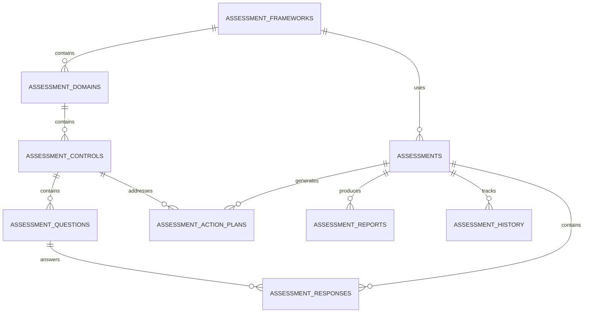
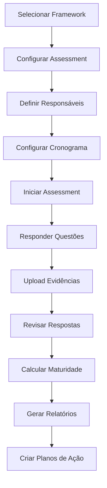
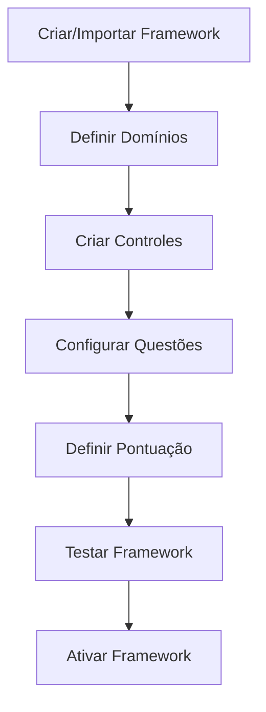

# 📋 Módulo de Assessment - Documentação Completa

## 🎯 Visão Geral

O Módulo de Assessment é uma solução completa para avaliação de maturidade e compliance organizacional. Desenvolvido com foco em multi-tenancy, segurança e escalabilidade, oferece uma plataforma robusta para gerenciar frameworks de compliance como ISO 27001, SOX, NIST, COBIT, LGPD/GDPR e frameworks customizados.

## 🏗️ Arquitetura

### Estrutura de Dados



### Componentes Principais

```
src/components/assessments/
├── views/                          # Páginas principais
│   ├── AssessmentsDashboardPro.tsx # Dashboard principal
│   ├── FrameworksManagement.tsx    # Gestão de frameworks
│   ├── AssessmentExecution.tsx     # Execução de assessments
│   ├── QuestionsLibrary.tsx        # Biblioteca de questões
│   ├── ActionPlansView.tsx         # Gestão de planos de ação
│   └── ReportsView.tsx             # Relatórios e analytics
├── components/                     # Componentes reutilizáveis
│   ├── AssessmentCard.tsx          # Card de assessment
│   ├── FrameworkSelector.tsx       # Seletor de framework
│   ├── MaturityChart.tsx           # Gráfico de maturidade
│   ├── QuestionRenderer.tsx        # Renderizador de questões
│   ├── EvidenceUploader.tsx        # Upload de evidências
│   └── ComplianceHeatmap.tsx       # Mapa de calor de compliance
├── wizards/                        # Wizards complexos
│   ├── AssessmentWizard.tsx        # Wizard de criação
│   ├── FrameworkBuilder.tsx        # Construtor de frameworks
│   └── BulkImportWizard.tsx        # Importação em lote
├── shared/                         # Utilitários compartilhados
│   ├── types.ts                    # Tipos TypeScript
│   ├── constants.ts                # Constantes
│   ├── calculations.ts             # Cálculos de maturidade
│   └── validators.ts               # Validadores
└── hooks/                          # Hooks específicos
    ├── useAssessments.ts           # Hook principal
    ├── useFrameworks.ts            # Hook de frameworks
    ├── useMaturityCalculation.ts   # Cálculo de maturidade
    └── useAssessmentWorkflow.ts    # Workflow de assessments
```

## 🗄️ Esquema do Banco de Dados

### Tabelas Principais

#### 1. assessment_frameworks
Armazena os frameworks de compliance (ISO 27001, SOX, NIST, etc.)

```sql
CREATE TABLE assessment_frameworks (
    id UUID PRIMARY KEY DEFAULT gen_random_uuid(),
    nome VARCHAR(255) NOT NULL,
    tipo_framework VARCHAR(50) NOT NULL,
    versao VARCHAR(50) DEFAULT '1.0',
    descricao TEXT,
    is_active BOOLEAN DEFAULT true,
    is_standard BOOLEAN DEFAULT false,
    tenant_id UUID NOT NULL,
    created_at TIMESTAMP WITH TIME ZONE DEFAULT NOW(),
    updated_at TIMESTAMP WITH TIME ZONE DEFAULT NOW()
);
```

#### 2. assessment_domains
Domínios/áreas dentro de cada framework

```sql
CREATE TABLE assessment_domains (
    id UUID PRIMARY KEY DEFAULT gen_random_uuid(),
    framework_id UUID NOT NULL REFERENCES assessment_frameworks(id),
    nome VARCHAR(255) NOT NULL,
    codigo VARCHAR(50) NOT NULL,
    descricao TEXT,
    peso DECIMAL(5,2) DEFAULT 1.0,
    ordem INTEGER DEFAULT 0,
    tenant_id UUID NOT NULL
);
```

#### 3. assessment_controls
Controles específicos dentro de cada domínio

```sql
CREATE TABLE assessment_controls (
    id UUID PRIMARY KEY DEFAULT gen_random_uuid(),
    domain_id UUID NOT NULL REFERENCES assessment_domains(id),
    codigo VARCHAR(50) NOT NULL,
    titulo VARCHAR(500) NOT NULL,
    descricao TEXT,
    tipo_controle VARCHAR(20),
    criticidade VARCHAR(20),
    peso DECIMAL(5,2) DEFAULT 1.0,
    tenant_id UUID NOT NULL
);
```

#### 4. assessment_questions
Questões para avaliar cada controle

```sql
CREATE TABLE assessment_questions (
    id UUID PRIMARY KEY DEFAULT gen_random_uuid(),
    control_id UUID NOT NULL REFERENCES assessment_controls(id),
    pergunta TEXT NOT NULL,
    tipo_resposta VARCHAR(20),
    opcoes_resposta JSONB,
    peso DECIMAL(5,2) DEFAULT 1.0,
    evidencias_requeridas BOOLEAN DEFAULT false,
    tenant_id UUID NOT NULL
);
```

#### 5. assessments
Instâncias de avaliação

```sql
CREATE TABLE assessments (
    id UUID PRIMARY KEY DEFAULT gen_random_uuid(),
    framework_id UUID NOT NULL REFERENCES assessment_frameworks(id),
    titulo VARCHAR(255) NOT NULL,
    status VARCHAR(20) DEFAULT 'planejado',
    percentual_conclusao DECIMAL(5,2) DEFAULT 0,
    percentual_maturidade DECIMAL(5,2) DEFAULT 0,
    score_total DECIMAL(10,2) DEFAULT 0,
    tenant_id UUID NOT NULL
);
```

### Segurança e Multi-tenancy

Todas as tabelas implementam:

- **Row Level Security (RLS)**: Isolamento completo entre tenants
- **Políticas de acesso**: Baseadas no `tenant_id`
- **Auditoria**: Triggers automáticos para `updated_at`
- **Índices otimizados**: Para performance em consultas multi-tenant

## 🔧 Hooks e Services

### useAssessments

Hook principal para gerenciar assessments:

```typescript
const {
  assessments,
  isLoading,
  createAssessment,
  updateAssessment,
  deleteAssessment,
  isCreating,
  isUpdating,
  isDeleting
} = useAssessments({
  filters: {
    search: 'ISO 27001',
    status: ['em_andamento'],
    framework_type: ['ISO27001']
  },
  include_framework: true
});
```

### useFrameworks

Hook para gerenciar frameworks:

```typescript
const {
  frameworks,
  isLoading,
  createFramework,
  updateFramework,
  deleteFramework
} = useFrameworks({
  filters: {
    tipo_framework: ['ISO27001', 'SOX'],
    is_active: true
  },
  include_domains: true,
  include_controls: true
});
```

### useMaturityCalculation

Hook para cálculo de maturidade:

```typescript
const {
  maturityData,
  isLoading,
  recalculateMaturity,
  isRecalculating
} = useMaturityCalculation(assessmentId);
```

## 🎨 Componentes UI

### AssessmentsDashboardPro

Dashboard principal com:
- Métricas em tempo real
- Filtros avançados
- Ações em lote
- Cards expansíveis
- Visualizações interativas

```typescript
<AssessmentsDashboardPro className="custom-class" />
```

### FrameworksManagement

Gestão completa de frameworks:
- CRUD de frameworks
- Importação de templates
- Visualização hierárquica
- Estatísticas detalhadas

```typescript
<FrameworksManagement className="custom-class" />
```

## 📊 Cálculo de Maturidade

### Algoritmo de Pontuação

1. **Pontuação por Questão**: Baseada no tipo de resposta
   - Sim/Não: 0 ou 100 pontos
   - Escala 1-5: (resposta/5) * 100
   - Escala 1-10: (resposta/10) * 100
   - Percentual: valor direto

2. **Pontuação por Controle**: Média ponderada das questões

3. **Pontuação por Domínio**: Média ponderada dos controles

4. **Pontuação Final**: Média ponderada dos domínios

### Níveis de Maturidade

- **Inexistente (0-19%)**: Processos não implementados
- **Inicial (20-39%)**: Processos ad-hoc e caóticos
- **Definido (40-59%)**: Processos documentados
- **Gerenciado (60-79%)**: Processos monitorados
- **Otimizado (80-100%)**: Melhoria contínua

## 🔄 Workflows

### Criação de Assessment



### Gestão de Frameworks



## 🚀 Instalação e Configuração

### 1. Aplicar Esquema do Banco

```bash
# Executar o script de instalação
node apply-assessment-schema.js
```

### 2. Configurar Permissões

Certifique-se de que o usuário tem as permissões necessárias:

```sql
-- Conceder permissões para o módulo de assessment
GRANT ALL ON assessment_frameworks TO authenticated;
GRANT ALL ON assessment_domains TO authenticated;
GRANT ALL ON assessment_controls TO authenticated;
GRANT ALL ON assessment_questions TO authenticated;
GRANT ALL ON assessments TO authenticated;
GRANT ALL ON assessment_responses TO authenticated;
GRANT ALL ON assessment_action_plans TO authenticated;
GRANT ALL ON assessment_reports TO authenticated;
```

### 3. Configurar Rotas

Adicionar as rotas no `App.tsx`:

```typescript
// Importar componentes
const AssessmentsDashboardPro = lazy(() => import("@/components/assessments/views/AssessmentsDashboardPro"));
const FrameworksManagement = lazy(() => import("@/components/assessments/views/FrameworksManagement"));

// Adicionar rotas
<Route path="assessments" element={
  <Suspense fallback={<PageLoader />}>
    <AssessmentsDashboardPro />
  </Suspense>
} />
<Route path="assessments/frameworks" element={
  <Suspense fallback={<PageLoader />}>
    <FrameworksManagement />
  </Suspense>
} />
```

## 📋 Frameworks Suportados

### Frameworks Padrão

1. **ISO 27001:2022** - Information Security Management
2. **SOX** - Sarbanes-Oxley Act
3. **NIST Cybersecurity Framework** - NIST CSF
4. **COBIT 2019** - Control Objectives for IT
5. **LGPD** - Lei Geral de Proteção de Dados
6. **GDPR** - General Data Protection Regulation
7. **PCI DSS** - Payment Card Industry Data Security Standard
8. **HIPAA** - Health Insurance Portability and Accountability Act

### Frameworks Customizados

O sistema permite criar frameworks totalmente customizados com:
- Domínios personalizados
- Controles específicos
- Questões adaptadas
- Pontuação customizada

## 🔗 Integrações

### Módulo de Risks

- Gaps identificados geram riscos automaticamente
- Controles vinculados entre módulos
- Planos de ação integrados

### Módulo de Compliance

- Status de compliance alimentado pelos assessments
- Evidências compartilhadas
- Calendário de reassessments

### Módulo de Policies

- Políticas como evidências
- Gaps indicam necessidade de novas políticas
- Aprovações integradas

## 📈 Analytics e Relatórios

### Tipos de Relatórios

1. **Executivo**: Visão geral para liderança
2. **Detalhado**: Análise completa por controle
3. **Gaps**: Identificação de lacunas
4. **Maturidade**: Evolução temporal
5. **Comparativo**: Benchmarking entre assessments
6. **Planos de Ação**: Status de implementação

### Métricas Disponíveis

- Taxa de conclusão
- Percentual de maturidade
- Distribuição por nível
- Gaps críticos
- Planos de ação pendentes
- Evolução temporal

## 🔒 Segurança

### Controles Implementados

- **Autenticação**: Integrada com sistema principal
- **Autorização**: Baseada em roles e permissões
- **Multi-tenancy**: Isolamento completo de dados
- **Auditoria**: Log de todas as ações
- **Criptografia**: Dados sensíveis protegidos
- **Backup**: Retenção configurável

### Compliance

O módulo atende aos requisitos de:
- ISO 27001 (Gestão de Segurança da Informação)
- SOX (Controles Internos)
- LGPD/GDPR (Proteção de Dados)
- Auditoria externa

## 🚀 Roadmap

### Versão 2.0 (Próximas Features)

- [ ] **AI/ML Integration**
  - Sugestões automáticas de respostas
  - Análise de evidências por IA
  - Predição de scores

- [ ] **Workflow Engine**
  - Aprovações automáticas
  - Notificações inteligentes
  - Escalação de gaps críticos

- [ ] **Advanced Analytics**
  - Dashboards executivos
  - Benchmarking industry
  - Predição de tendências

- [ ] **Mobile App**
  - Assessments offline
  - Notificações push
  - Aprovações móveis

### Versão 3.0 (Futuro)

- [ ] **Blockchain Integration**
  - Evidências imutáveis
  - Auditoria distribuída
  - Certificações digitais

- [ ] **API Marketplace**
  - Integrações terceiros
  - Frameworks externos
  - Dados de mercado

## 🤝 Contribuição

### Como Contribuir

1. **Fork** o repositório
2. **Crie** uma branch para sua feature
3. **Implemente** seguindo os padrões
4. **Teste** completamente
5. **Submeta** um Pull Request

### Padrões de Código

- **TypeScript**: Tipagem rigorosa
- **ESLint**: Linting automático
- **Prettier**: Formatação consistente
- **Tests**: Cobertura mínima 80%
- **Documentation**: JSDoc obrigatório

## 📞 Suporte

### Canais de Suporte

- **Email**: suporte@grc-platform.com
- **Slack**: #assessment-module
- **GitHub**: Issues e Discussions
- **Documentação**: Wiki completo

### SLA

- **Bugs Críticos**: 4 horas
- **Bugs Normais**: 24 horas
- **Features**: Próximo release
- **Dúvidas**: 2 horas úteis

---

## 📄 Licença

Este módulo é parte da plataforma GRC e está licenciado sob os termos da licença proprietária da empresa. Para mais informações, consulte o arquivo LICENSE.

---

**Desenvolvido com ❤️ pela equipe GRC Platform**