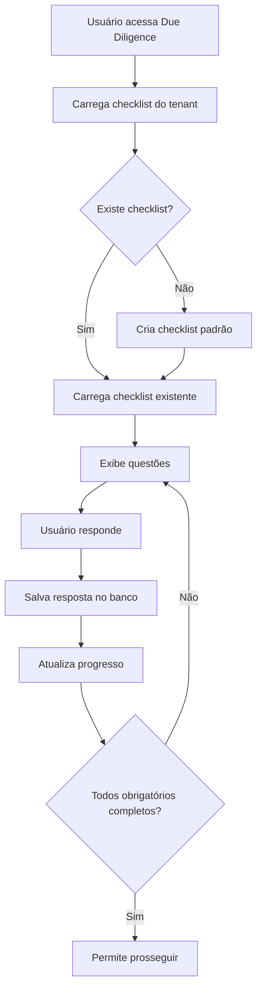

# Checklist Editável para Due Diligence de Fornecedores

## Visão Geral

Implementação de um checklist editável para a etapa de Due Diligence no módulo Vendor Risk, conforme especificado:

### Funcionalidades Implementadas

✅ **Checklist Editável**: Usuários podem adicionar, editar e remover questões do checklist
✅ **Questões Padrão**: 5 questões padrão conforme especificado
✅ **Botões com Cores Específicas**: 
- 🟢 **Compliance** (Verde)
- 🟡 **Compliance com Ressalva** (Amarelo) 
- 🔴 **Não Compliance** (Vermelho)
✅ **Justificativas**: Campo obrigatório para respostas "Não Compliance"
✅ **Persistência**: Dados salvos no banco de dados
✅ **Multi-tenant**: Isolamento por tenant

## Questões Padrão

O sistema inclui automaticamente as seguintes questões padrão:

1. **Registro Empresarial Válido (CNPJ)**
   - Descrição: CNPJ ativo na Receita Federal com situação cadastral regular
   - Categoria: Legal
   - Obrigatório: Sim

2. **Cláusula Contratual de Privacidade**
   - Descrição: Cláusulas específicas sobre proteção de dados e privacidade conforme LGPD
   - Categoria: Legal
   - Obrigatório: Sim

3. **Cláusulas Contratuais de Segurança da Informação**
   - Descrição: Disposições contratuais sobre segurança da informação e proteção de dados
   - Categoria: Segurança
   - Obrigatório: Sim

4. **Cláusula Contratual de NDA**
   - Descrição: Acordo de confidencialidade (Non-Disclosure Agreement) assinado
   - Categoria: Legal
   - Obrigatório: Sim

5. **Cláusula Contratual de SLA**
   - Descrição: Service Level Agreement com métricas e penalidades definidas
   - Categoria: Operacional
   - Obrigatório: Sim

## Arquivos Criados/Modificados

### Novos Componentes
- `src/components/vendor-risk/shared/EditableChecklistManager.tsx` - Componente principal do checklist editável
- `src/components/vendor-risk/workflows/VendorOnboardingWorkflowUpdated.tsx` - Workflow atualizado com checklist editável

### Scripts SQL
- `sql/create_editable_checklist_tables.sql` - Criação das tabelas necessárias
- `sql/insert_default_checklist_items.sql` - Inserção dos itens padrão

### Documentação
- `VENDOR_RISK_EDITABLE_CHECKLIST.md` - Este arquivo de documentação

## Estrutura do Banco de Dados

### Tabela: `vendor_checklist_templates`
Armazena os templates de questões do checklist por tenant.

```sql
- id (UUID, PK)
- tenant_id (UUID, FK)
- title (TEXT) - Título da questão
- description (TEXT) - Descrição detalhada
- required (BOOLEAN) - Se é obrigatória
- category (TEXT) - Categoria (legal, security, operational, etc.)
- order_index (INTEGER) - Ordem de exibição
- is_default (BOOLEAN) - Se é questão padrão do sistema
- created_by (UUID, FK)
- created_at, updated_at (TIMESTAMP)
```

### Tabela: `vendor_checklist_responses`
Armazena as respostas do checklist por fornecedor.

```sql
- id (UUID, PK)
- vendor_id (UUID, FK)
- item_id (UUID, FK)
- status (TEXT) - compliant, non_compliant, compliant_with_reservation
- justification (TEXT) - Justificativa da resposta
- attachments (JSONB) - Array de anexos
- responded_by (UUID, FK)
- responded_at, created_at, updated_at (TIMESTAMP)
```

## Como Usar

### 1. Instalação
Execute os scripts SQL na ordem:
```bash
# 1. Criar tabelas
psql -f sql/create_editable_checklist_tables.sql

# 2. Inserir dados padrão
psql -f sql/insert_default_checklist_items.sql
```

### 2. Integração no Workflow
Substitua o componente `DueDiligenceStep` pelo `DueDiligenceStepUpdated` no workflow de onboarding:

```tsx
import { VendorOnboardingWorkflowUpdated } from './workflows/VendorOnboardingWorkflowUpdated';

// Use VendorOnboardingWorkflowUpdated em vez de VendorOnboardingWorkflow
```

### 3. Funcionalidades do Usuário

#### Visualizar Checklist
- O checklist é carregado automaticamente com as questões padrão
- Progresso é mostrado em tempo real
- Status visual por cores (verde, amarelo, vermelho)

#### Editar Checklist
1. Clique em "Editar Checklist"
2. Use os ícones de edição (✏️) para modificar questões existentes
3. Use o ícone de lixeira (🗑️) para remover questões customizadas
4. Clique em "Adicionar Nova Questão" para criar questões personalizadas

#### Responder Questões
1. Clique em um dos três botões de status:
   - **Compliance** (Verde)
   - **Compliance com Ressalva** (Amarelo)
   - **Não Compliance** (Vermelho)
2. Preencha a justificativa (obrigatória para "Não Compliance")
3. As respostas são salvas automaticamente

#### Progressão
- Todos os itens obrigatórios devem ter status "Compliance" ou "Compliance com Ressalva"
- O progresso é calculado automaticamente
- Só é possível prosseguir quando todos os obrigatórios estão completos

## Características Técnicas

### Segurança
- **Row Level Security (RLS)** implementado
- Isolamento por tenant
- Validação de permissões

### Performance
- Índices otimizados para consultas frequentes
- Carregamento lazy dos dados
- Atualizações em tempo real

### Usabilidade
- Interface responsiva
- Feedback visual imediato
- Validações em tempo real
- Mensagens de erro claras

### Extensibilidade
- Categorias customizáveis
- Tipos de anexos configuráveis
- Workflows personalizáveis por tenant

## Fluxo de Dados



## Próximos Passos

### Melhorias Futuras
1. **Anexos de Arquivos**: Implementar upload e gestão de documentos
2. **Templates por Categoria**: Checklists específicos por tipo de fornecedor
3. **Aprovação de Mudanças**: Workflow para aprovar modificações no checklist
4. **Relatórios**: Dashboard com estatísticas de compliance
5. **Integração com IA**: Sugestões automáticas de questões baseadas no perfil do fornecedor

### Considerações de Implementação
- Testar com diferentes volumes de dados
- Implementar cache para melhor performance
- Adicionar logs de auditoria para mudanças no checklist
- Considerar versionamento dos templates

## Suporte

Para dúvidas ou problemas:
1. Verifique os logs do console do navegador
2. Confirme se as tabelas foram criadas corretamente
3. Verifique as permissões RLS no Supabase
4. Teste com dados de exemplo

---

**Implementado por**: Sistema ALEX VENDOR  
**Data**: Janeiro 2025  
**Versão**: 1.0.0