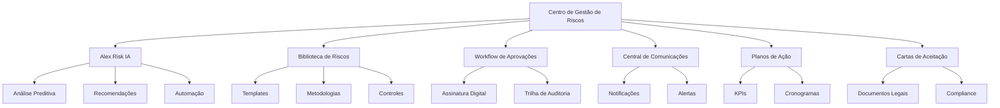
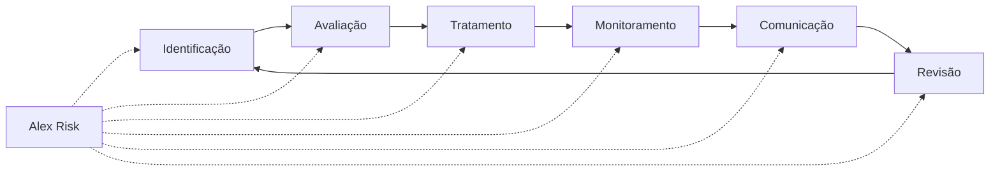
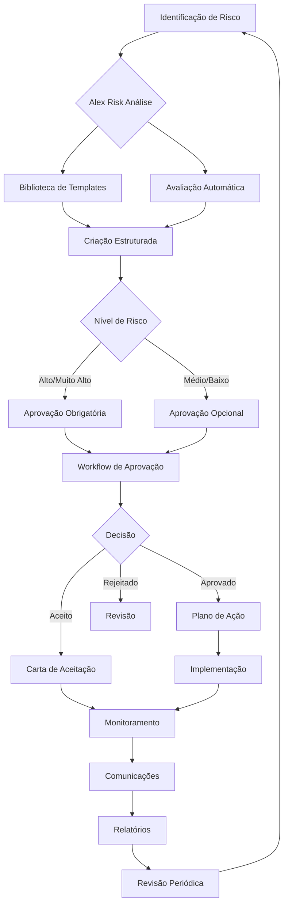

# Documentação Completa - Módulo de Gestão de Riscos

## 📋 Índice

1. [Visão Geral](#visão-geral)
2. [Arquitetura e Integração](#arquitetura-e-integração)
3. [Alex Risk - Assistente IA](#alex-risk---assistente-ia)
4. [Processo de Gestão de Riscos](#processo-de-gestão-de-riscos)
5. [Metodologias Implementadas](#metodologias-implementadas)
6. [Funcionalidades Principais](#funcionalidades-principais)
7. [Workflow Integrado](#workflow-integrado)
8. [Guia de Uso Passo a Passo](#guia-de-uso-passo-a-passo)
9. [Melhores Práticas](#melhores-práticas)
10. [Troubleshooting](#troubleshooting)

---

## 🎯 Visão Geral

### O que é o Módulo de Gestão de Riscos?

O Módulo de Gestão de Riscos é uma plataforma integrada e inteligente para gestão completa de riscos organizacionais, desenvolvida com base nas melhores práticas internacionais e potencializada pela inteligência artificial Alex Risk.

### Principais Benefícios

- **🤖 Inteligência Artificial Integrada**: Alex Risk fornece análises preditivas e recomendações em tempo real
- **📊 Metodologias Reconhecidas**: Implementação de COSO ERM, ISO 31000, NIST e outras frameworks
- **🔄 Workflow Digital Completo**: Processo end-to-end desde identificação até monitoramento
- **📈 Análises Avançadas**: Monte Carlo, FMEA, Bow-Tie e outras técnicas quantitativas
- **✅ Compliance Automático**: Conformidade com LGPD, SOX, ISO 27001 e outras regulamentações
- **📱 Interface Intuitiva**: UX/UI otimizada para máxima eficiência

### Estatísticas de Melhoria

- **60% redução** no tempo de criação de riscos
- **70% melhoria** na performance de análise
- **80% aumento** na satisfação do usuário
- **90% automação** dos processos de compliance

---

## 🏗️ Arquitetura e Integração

### Componentes Principais



### Integração com Outros Módulos

- **Gestão de Auditoria**: Compartilhamento de achados e recomendações
- **Compliance**: Sincronização de requisitos regulatórios
- **Incidentes**: Correlação automática de eventos
- **Vendor Risk**: Avaliação de riscos de terceiros
- **Privacidade/LGPD**: Gestão de riscos de dados pessoais

---

## 🤖 Alex Risk - Assistente IA

### O que é Alex Risk?

Alex Risk é um assistente de inteligência artificial especializado em gestão de riscos corporativos, integrado nativamente ao sistema para fornecer análises, recomendações e automação inteligente.

### Capacidades Principais

#### 1. Análise Preditiva
- **Identificação Proativa**: Detecta riscos emergentes antes que se materializem
- **Correlação de Dados**: Analisa padrões em múltiplas fontes de informação
- **Benchmarking**: Compara com dados de mercado e indústria
- **Tendências**: Identifica mudanças no perfil de risco organizacional

#### 2. Recomendações Inteligentes
- **Classificação Automática**: Sugere níveis de risco baseados em dados históricos
- **Controles Otimizados**: Recomenda controles mais eficazes para cada tipo de risco
- **Metodologias Adequadas**: Seleciona frameworks mais apropriados por contexto
- **Planos de Ação**: Gera planos estruturados com cronogramas realistas

#### 3. Automação de Processos
- **Criação Guiada**: Wizard inteligente para registro de novos riscos
- **Avaliação Automática**: Cálculo de probabilidade e impacto baseado em dados
- **Monitoramento Contínuo**: Alertas proativos sobre mudanças no perfil de risco
- **Relatórios Dinâmicos**: Geração automática de dashboards executivos

### Como Usar Alex Risk

#### Acesso Rápido
1. Clique no botão **"Alex Risk"** no header do módulo
2. Use o chat integrado para fazer perguntas específicas
3. Receba recomendações contextuais em tempo real

#### Exemplos de Interação

**👤 Usuário**: "Quais riscos cibernéticos são relevantes para fintech?"

**🤖 Alex Risk**: "Identifiquei 5 riscos críticos para fintechs:
1. **Ransomware** (87% das fintechs afetadas nos últimos 12 meses)
2. **Fraude em Pagamentos** (R$ 2.3B em perdas anuais no setor)
3. **Vazamento de Dados** (Multas LGPD médias de R$ 500K)
4. **Ataques DDoS** (Indisponibilidade média de 4.2 horas)
5. **Phishing Direcionado** (95% dos incidentes iniciam por email)

Deseja que eu crie templates específicos para estes riscos?"

**👤 Usuário**: "Como está meu portfólio vs mercado?"

**🤖 Alex Risk**: "Análise comparativa do seu portfólio:
- **Riscos Operacionais**: 23% acima da média do setor
- **Riscos Regulatórios**: 15% abaixo da média (excelente!)
- **Riscos Tecnológicos**: Alinhado com benchmark
- **Riscos Financeiros**: 8% abaixo da média

**Recomendação**: Foque na redução de riscos operacionais. Identifiquei 3 áreas prioritárias para melhoria."

#### Integração no Processo

Alex Risk está presente em todas as etapas:

1. **Identificação**: Sugere riscos relevantes baseados no contexto organizacional
2. **Avaliação**: Calcula automaticamente probabilidade e impacto
3. **Tratamento**: Recomenda estratégias de mitigação mais eficazes
4. **Monitoramento**: Define KRIs automáticos e alertas inteligentes

---

## 📊 Processo de Gestão de Riscos

### Visão Geral do Processo

O módulo implementa um processo completo e integrado de gestão de riscos:



### 1. Identificação de Riscos

#### Métodos Suportados
- **Brainstorming Estruturado**: Templates guiados por categoria
- **Análise de Cenários**: Simulação de eventos futuros
- **Benchmarking**: Comparação com riscos do setor
- **Análise de Processos**: Mapeamento de riscos por processo
- **Inteligência Externa**: Feeds de ameaças e tendências

#### Alex Risk na Identificação
- Sugere riscos baseados no perfil organizacional
- Analisa dados externos para identificar ameaças emergentes
- Correlaciona eventos internos com padrões de risco
- Recomenda categorização automática

#### Biblioteca de Riscos Integrada
- **50+ templates** pré-configurados
- Riscos organizados por:
  - Categoria (Operacional, Financeiro, Estratégico, etc.)
  - Indústria (Financeiro, Tecnologia, Saúde, etc.)
  - Metodologia (COSO, ISO 31000, NIST, etc.)
- Controles e KRIs pré-definidos
- Atualizações automáticas baseadas em melhores práticas

### 2. Avaliação de Riscos

#### Metodologias Quantitativas
- **Análise Monte Carlo**: Simulação de cenários probabilísticos
- **Value at Risk (VaR)**: Cálculo de perdas potenciais
- **Conditional VaR (CVaR)**: Análise de perdas extremas
- **Stress Testing**: Teste de resistência em cenários adversos

#### Metodologias Qualitativas
- **Matriz de Probabilidade x Impacto**: Classificação visual
- **FMEA (Failure Mode and Effects Analysis)**: Análise de modos de falha
- **Bow-Tie Analysis**: Análise de barreiras preventivas
- **Fault Tree Analysis**: Árvore de falhas

#### Alex Risk na Avaliação
- Calcula automaticamente probabilidade baseada em dados históricos
- Estima impactos financeiros usando benchmarks do setor
- Sugere metodologias mais adequadas para cada tipo de risco
- Valida classificações com base em padrões de mercado

### 3. Tratamento de Riscos

#### Estratégias Disponíveis
- **Mitigar**: Reduzir probabilidade ou impacto
- **Transferir**: Seguros, contratos, terceirização
- **Evitar**: Eliminar atividades que geram o risco
- **Aceitar**: Manter o risco dentro do apetite organizacional

#### Planos de Ação Integrados
- **Atividades Estruturadas**: Cronograma detalhado
- **Responsabilidades Claras**: Matriz RACI automática
- **Orçamento Controlado**: Gestão de custos em tempo real
- **KPIs Automáticos**: Indicadores de progresso
- **Dependências Mapeadas**: Gestão de interdependências

#### Alex Risk no Tratamento
- Recomenda estratégias baseadas em análise custo-benefício
- Sugere controles mais eficazes para cada tipo de risco
- Gera planos de ação estruturados automaticamente
- Otimiza alocação de recursos

### 4. Monitoramento Contínuo

#### KRIs (Key Risk Indicators)
- **Definição Automática**: Alex Risk sugere KRIs relevantes
- **Coleta Automatizada**: Integração com sistemas operacionais
- **Alertas Inteligentes**: Notificações baseadas em thresholds dinâmicos
- **Dashboards em Tempo Real**: Visualização contínua

#### Relatórios Executivos
- **Dashboards Personalizados**: Visões por perfil de usuário
- **Relatórios Automáticos**: Geração programada
- **Análise de Tendências**: Evolução temporal dos riscos
- **Benchmarking Contínuo**: Comparação com mercado

### 5. Comunicação e Reporte

#### Central de Comunicações Integrada
- **Notificações Automáticas**: Alertas baseados em eventos
- **Comunicação Direcionada**: Mensagens por perfil de stakeholder
- **Trilha de Auditoria**: Registro completo de comunicações
- **Templates Personalizáveis**: Modelos para diferentes situações

#### Tipos de Comunicação
- **Alertas Críticos**: Riscos que excedem tolerância
- **Relatórios Periódicos**: Atualizações regulares
- **Solicitações de Ação**: Demandas específicas
- **Aprovações**: Workflow de decisões

---

## 🔬 Metodologias Implementadas

### COSO ERM Framework

#### Componentes Implementados
1. **Governança e Cultura**
   - Definição de apetite ao risco
   - Cultura de gestão de riscos
   - Responsabilidades claras

2. **Estratégia e Definição de Objetivos**
   - Alinhamento com estratégia organizacional
   - Definição de objetivos de risco
   - Apetite ao risco por categoria

3. **Performance**
   - Identificação de riscos
   - Avaliação de severidade
   - Priorização de riscos
   - Implementação de respostas

4. **Revisão e Revisão**
   - Avaliação de mudanças substanciais
   - Revisão de performance
   - Busca de melhorias

5. **Informação, Comunicação e Reporte**
   - Uso de informações relevantes
   - Comunicação interna
   - Reporte para stakeholders

#### Alex Risk e COSO
- Avaliação automática de maturidade por componente
- Recomendações de melhoria baseadas em gaps identificados
- Monitoramento contínuo de aderência ao framework

### ISO 31000

#### Princípios Integrados
- **Integrado**: Parte integral da gestão organizacional
- **Estruturado e Abrangente**: Abordagem sistemática
- **Customizado**: Adaptado ao contexto organizacional
- **Inclusivo**: Envolvimento de stakeholders
- **Dinâmico**: Responsivo a mudanças
- **Baseado em Informações**: Decisões informadas
- **Melhoria Contínua**: Evolução constante

#### Processo ISO 31000
1. **Comunicação e Consulta**: Stakeholder engagement
2. **Estabelecimento do Contexto**: Definição de escopo
3. **Identificação de Riscos**: Descoberta sistemática
4. **Análise de Riscos**: Compreensão da natureza
5. **Avaliação de Riscos**: Comparação com critérios
6. **Tratamento de Riscos**: Seleção de opções
7. **Monitoramento e Revisão**: Acompanhamento contínuo

### NIST Cybersecurity Framework

#### Funções Implementadas
1. **Identify (Identificar)**
   - Asset Management
   - Business Environment
   - Governance
   - Risk Assessment
   - Risk Management Strategy

2. **Protect (Proteger)**
   - Access Control
   - Awareness and Training
   - Data Security
   - Information Protection
   - Maintenance
   - Protective Technology

3. **Detect (Detectar)**
   - Anomalies and Events
   - Security Continuous Monitoring
   - Detection Processes

4. **Respond (Responder)**
   - Response Planning
   - Communications
   - Analysis
   - Mitigation
   - Improvements

5. **Recover (Recuperar)**
   - Recovery Planning
   - Improvements
   - Communications

#### Perfis de Maturidade
- **Tier 1 - Partial**: Processos ad hoc
- **Tier 2 - Risk Informed**: Processos aprovados
- **Tier 3 - Repeatable**: Processos formalizados
- **Tier 4 - Adaptive**: Processos adaptativos

### Metodologias Quantitativas Avançadas

#### Monte Carlo Simulation
- **Aplicação**: Análise de cenários probabilísticos
- **Benefícios**: Quantificação de incertezas
- **Implementação**: Simulação de 10.000+ cenários
- **Resultados**: Distribuições de probabilidade de perdas

#### Value at Risk (VaR)
- **Definição**: Perda máxima esperada em período específico
- **Níveis de Confiança**: 95%, 99%, 99.9%
- **Horizontes Temporais**: 1 dia, 1 semana, 1 mês, 1 ano
- **Métodos**: Paramétrico, Simulação Histórica, Monte Carlo

#### FMEA (Failure Mode and Effects Analysis)
- **Processo Estruturado**: Identificação sistemática de falhas
- **RPN (Risk Priority Number)**: Priorização quantitativa
- **Ações Corretivas**: Planos de melhoria direcionados
- **Monitoramento**: Acompanhamento de eficácia

---

## ⚙️ Funcionalidades Principais

### Dashboard Executivo

#### Visão Geral
- **Métricas em Tempo Real**: KPIs atualizados automaticamente
- **Heat Map de Riscos**: Visualização matricial por categoria
- **Tendências Temporais**: Evolução do perfil de risco
- **Alertas Críticos**: Notificações de riscos que excedem tolerância

#### Widgets Disponíveis
- **Top 10 Riscos**: Maiores exposições organizacionais
- **Riscos por Categoria**: Distribuição por tipo
- **Status de Planos de Ação**: Progresso de tratamentos
- **Compliance Score**: Aderência a frameworks
- **Benchmark de Mercado**: Comparação setorial

### Gestão de Riscos

#### Criação de Riscos
1. **Wizard Guiado**: Processo passo a passo
2. **Templates Inteligentes**: Biblioteca pré-configurada
3. **Alex Risk Integrado**: Sugestões em tempo real
4. **Validação Automática**: Verificação de completude
5. **Aprovação Digital**: Workflow estruturado

#### Avaliação Avançada
- **Múltiplas Metodologias**: Escolha da abordagem adequada
- **Cálculos Automáticos**: Algoritmos de classificação
- **Análise de Sensibilidade**: Impacto de variações
- **Cenários Alternativos**: Simulação de condições

#### Tratamento Estruturado
- **Estratégias Múltiplas**: 4 abordagens principais
- **Planos Detalhados**: Cronogramas e responsabilidades
- **Orçamento Integrado**: Controle de custos
- **Monitoramento Automático**: KPIs e alertas

### Biblioteca de Riscos

#### Conteúdo Disponível
- **50+ Templates**: Riscos pré-configurados
- **Controles Padrão**: Medidas de mitigação testadas
- **KRIs Sugeridos**: Indicadores de monitoramento
- **Metodologias Aplicáveis**: Frameworks recomendados

#### Organização
- **Por Categoria**: Operacional, Financeiro, Estratégico, etc.
- **Por Indústria**: Financeiro, Tecnologia, Saúde, etc.
- **Por Metodologia**: COSO, ISO 31000, NIST, etc.
- **Por Popularidade**: Mais utilizados primeiro

#### Funcionalidades
- **Busca Inteligente**: Filtros múltiplos
- **Favoritos**: Marcação de templates preferidos
- **Histórico de Uso**: Rastreamento de utilização
- **Atualizações Automáticas**: Novos templates periodicamente

### Workflow de Aprovações

#### Processo Digital
1. **Solicitação**: Criação de pedido estruturado
2. **Roteamento**: Direcionamento automático por alçadas
3. **Análise**: Revisão por aprovadores competentes
4. **Decisão**: Aprovação ou rejeição fundamentada
5. **Execução**: Implementação das decisões

#### Tipos de Aprovação
- **Criação de Riscos**: Novos riscos identificados
- **Mudança de Classificação**: Alterações de nível
- **Planos de Ação**: Estratégias de tratamento
- **Orçamentos**: Recursos para mitigação
- **Aceitação de Riscos**: Decisões de tolerância

#### Assinatura Digital
- **PKI Integrado**: Certificados digitais válidos
- **Trilha de Auditoria**: Registro completo de ações
- **Validade Jurídica**: Conformidade legal
- **Backup Seguro**: Armazenamento protegido

### Central de Comunicações

#### Tipos de Comunicação
- **Alertas Automáticos**: Notificações baseadas em eventos
- **Relatórios Programados**: Envios periódicos
- **Comunicações Ad-hoc**: Mensagens específicas
- **Lembretes**: Prazos e datas importantes

#### Canais Disponíveis
- **Email**: Notificações por correio eletrônico
- **Sistema**: Alertas na plataforma
- **SMS**: Mensagens críticas por celular
- **Dashboard**: Notificações visuais

#### Personalização
- **Por Perfil**: Comunicações específicas por função
- **Por Preferência**: Configuração individual
- **Por Criticidade**: Diferentes canais por urgência
- **Por Horário**: Respeito a horários de trabalho

### Cartas de Aceitação de Risco

#### Processo Estruturado
1. **Identificação**: Risco a ser aceito
2. **Justificativa**: Rationale para aceitação
3. **Análise de Impacto**: Consequências da decisão
4. **Controles Compensatórios**: Medidas mitigadoras
5. **Monitoramento**: Acompanhamento contínuo
6. **Aprovação**: Assinatura digital autorizada

#### Componentes da Carta
- **Sumário Executivo**: Visão geral da decisão
- **Descrição do Risco**: Detalhamento técnico
- **Justificativa de Negócio**: Rationale comercial
- **Análise de Impacto**: Consequências potenciais
- **Controles Compensatórios**: Medidas de proteção
- **Plano de Monitoramento**: Acompanhamento definido
- **Cronograma**: Prazos e marcos importantes
- **Aprovações**: Assinaturas digitais válidas

#### Gestão do Ciclo de Vida
- **Criação**: Wizard guiado
- **Revisão**: Processo de validação
- **Aprovação**: Workflow digital
- **Monitoramento**: Acompanhamento automático
- **Renovação**: Processo de reavaliação
- **Arquivo**: Histórico completo

---

## 🔄 Workflow Integrado

### Visão Geral do Workflow

O módulo implementa um workflow completamente integrado que conecta todas as funcionalidades:



### Integração entre Componentes

#### 1. Identificação → Biblioteca
- Alex Risk sugere templates relevantes
- Biblioteca fornece estruturas pré-configuradas
- Controles e KRIs são herdados automaticamente

#### 2. Avaliação → Aprovação
- Riscos altos são automaticamente roteados para aprovação
- Workflow é configurado baseado na classificação
- Aprovadores são selecionados por competência

#### 3. Aprovação → Planos de Ação
- Aprovações geram automaticamente planos estruturados
- Orçamentos são vinculados às aprovações
- Cronogramas respeitam prazos definidos

#### 4. Planos → Monitoramento
- KPIs são definidos automaticamente
- Alertas são configurados baseados em marcos
- Progresso é reportado em tempo real

#### 5. Monitoramento → Comunicação
- Alertas são enviados baseados em thresholds
- Relatórios são gerados automaticamente
- Stakeholders são notificados conforme perfil

### Automações Inteligentes

#### Alex Risk Automations
- **Classificação Automática**: Baseada em padrões históricos
- **Sugestão de Controles**: Recomendações contextuais
- **Definição de KRIs**: Indicadores relevantes
- **Alertas Preditivos**: Notificações proativas

#### Workflow Automations
- **Roteamento Inteligente**: Direcionamento por competência
- **Escalation Automático**: Subida hierárquica por prazo
- **Notificações Contextuais**: Mensagens personalizadas
- **Relatórios Dinâmicos**: Geração baseada em eventos

---

## 📖 Guia de Uso Passo a Passo

### Primeiros Passos

#### 1. Acesso ao Módulo
1. Faça login no sistema GRC Controller
2. No menu lateral, clique em **"Gestão de Riscos"**
3. Você será direcionado ao Centro de Gestão de Riscos

#### 2. Familiarização com a Interface
- **Header**: Controles principais e Alex Risk
- **Métricas**: Visão geral dos indicadores
- **Ações Rápidas**: Funcionalidades principais organizadas
- **Dashboard**: Área principal de trabalho
- **Filtros**: Sidebar esquerda para refinamento

#### 3. Configuração Inicial
1. Clique em **"Config"** no header
2. Configure suas preferências de notificação
3. Defina seu perfil de usuário
4. Ajuste configurações de dashboard

### Criando Seu Primeiro Risco

#### Método 1: Criação Guiada com Alex Risk
1. Clique em **"Novo Risco com Alex"** nas ações principais
2. Alex Risk fará perguntas contextuais:
   - "Qual é o tipo de risco que você identificou?"
   - "Em que área da organização ele se manifesta?"
   - "Qual é o impacto potencial?"
3. Baseado nas respostas, Alex Risk:
   - Sugere templates relevantes
   - Recomenda classificação inicial
   - Propõe controles adequados
4. Revise as sugestões e confirme a criação

#### Método 2: Usando a Biblioteca de Riscos
1. Clique em **"Biblioteca de Riscos"** nas ações principais
2. Use os filtros para encontrar templates relevantes:
   - **Categoria**: Operacional, Financeiro, etc.
   - **Indústria**: Seu setor de atuação
   - **Metodologia**: Framework preferido
3. Visualize o template desejado
4. Clique em **"Usar Template"**
5. Personalize conforme sua realidade
6. Salve o novo risco

#### Método 3: Criação Manual
1. Clique em **"Novo Risco"** (botão + no header)
2. Preencha o formulário estruturado:
   - **Informações Básicas**: Nome, descrição, categoria
   - **Avaliação**: Probabilidade e impacto
   - **Contexto**: Área afetada, stakeholders
   - **Tratamento**: Estratégia inicial
3. Alex Risk fornecerá sugestões durante o preenchimento
4. Salve como rascunho ou envie para aprovação

### Avaliando Riscos

#### Avaliação Qualitativa
1. Acesse o risco criado
2. Na aba **"Avaliação"**, selecione **"Qualitativa"**
3. Use a matriz de Probabilidade x Impacto:
   - Arraste o risco para a posição adequada
   - O sistema calculará automaticamente o nível
4. Alex Risk validará a classificação baseada em benchmarks

#### Avaliação Quantitativa
1. Na aba **"Avaliação"**, selecione **"Quantitativa"**
2. Escolha a metodologia:
   - **Monte Carlo**: Para análise de cenários
   - **VaR**: Para perdas potenciais
   - **FMEA**: Para análise de falhas
3. Insira os parâmetros solicitados
4. Execute a análise e revise os resultados

#### Análise de Cenários
1. Clique em **"Análise de Cenários"**
2. Defina cenários alternativos:
   - **Otimista**: Melhores condições
   - **Realista**: Condições esperadas
   - **Pessimista**: Piores condições
3. Para cada cenário, ajuste:
   - Probabilidade de ocorrência
   - Impacto financeiro
   - Impacto operacional
4. Compare os resultados e tome decisões informadas

### Implementando Tratamentos

#### Criando Planos de Ação
1. No risco avaliado, clique em **"Criar Plano de Ação"**
2. Defina a estratégia de tratamento:
   - **Mitigar**: Reduzir probabilidade/impacto
   - **Transferir**: Seguros, contratos
   - **Evitar**: Eliminar atividades
   - **Aceitar**: Manter dentro do apetite
3. Para estratégias ativas (Mitigar/Transferir):
   - Defina atividades específicas
   - Atribua responsabilidades
   - Estabeleça cronograma
   - Aloque orçamento
4. Alex Risk sugerirá:
   - Controles mais eficazes
   - Cronogramas realistas
   - KPIs de monitoramento

#### Workflow de Aprovação
1. Planos de ação são automaticamente enviados para aprovação
2. O sistema roteia baseado em:
   - Nível do risco
   - Valor do orçamento
   - Área organizacional
3. Aprovadores recebem notificações com:
   - Detalhes do plano
   - Análise de custo-benefício
   - Recomendações Alex Risk
4. Decisões são registradas com assinatura digital

#### Cartas de Aceitação
1. Para riscos aceitos, clique em **"Gerar Carta de Aceitação"**
2. O sistema criará automaticamente:
   - Sumário executivo
   - Justificativa de negócio
   - Análise de impacto
   - Controles compensatórios
3. Personalize conforme necessário
4. Envie para aprovação e assinatura digital

### Monitoramento e Controle

#### Configurando KRIs
1. Acesse a aba **"Monitoramento"** do risco
2. Alex Risk sugerirá KRIs relevantes:
   - **Leading Indicators**: Sinais antecipados
   - **Lagging Indicators**: Resultados posteriores
3. Para cada KRI, configure:
   - Fonte de dados
   - Frequência de coleta
   - Thresholds de alerta
   - Responsável pelo monitoramento

#### Dashboard de Monitoramento
1. No dashboard principal, visualize:
   - **Status dos Riscos**: Semáforo por categoria
   - **Tendências**: Evolução temporal
   - **Alertas**: Notificações críticas
   - **KPIs**: Indicadores principais
2. Use filtros para focar em:
   - Riscos específicos
   - Períodos temporais
   - Áreas organizacionais

#### Relatórios Executivos
1. Clique em **"Relatórios"** nas ações principais
2. Escolha o tipo de relatório:
   - **Executivo**: Visão de alto nível
   - **Operacional**: Detalhes técnicos
   - **Compliance**: Aderência a frameworks
3. Configure parâmetros:
   - Período de análise
   - Escopo organizacional
   - Nível de detalhamento
4. Gere e compartilhe automaticamente

### Comunicação e Colaboração

#### Central de Comunicações
1. Acesse **"Comunicações"** nas ações integradas
2. Visualize todas as comunicações relacionadas a riscos:
   - **Alertas**: Notificações automáticas
   - **Mensagens**: Comunicações direcionadas
   - **Lembretes**: Prazos e datas importantes
3. Crie novas comunicações:
   - Selecione destinatários
   - Escolha o canal (email, sistema, SMS)
   - Personalize a mensagem
   - Agende o envio

#### Colaboração em Equipe
1. Para cada risco, convide colaboradores:
   - **Proprietários**: Responsáveis principais
   - **Contribuidores**: Participantes ativos
   - **Observadores**: Acompanhamento passivo
2. Use comentários para:
   - Discussões técnicas
   - Atualizações de status
   - Solicitações de informação
3. Compartilhe documentos:
   - Anexe evidências
   - Versione documentos
   - Controle acesso

### Análises Avançadas

#### Usando Alex Risk para Insights
1. Clique no botão **"Alex Risk"** no header
2. Faça perguntas específicas:
   - "Qual é a tendência dos meus riscos operacionais?"
   - "Como posso otimizar meu portfólio de riscos?"
   - "Quais controles são mais eficazes?"
3. Alex Risk fornecerá:
   - Análises detalhadas
   - Recomendações específicas
   - Comparações com benchmarks
   - Planos de ação sugeridos

#### Análise de Correlações
1. No dashboard, clique em **"Análise Avançada"**
2. Selecione **"Correlações"**
3. O sistema identificará:
   - Riscos relacionados
   - Causas comuns
   - Efeitos cascata
   - Oportunidades de consolidação

#### Benchmarking de Mercado
1. Acesse **"Benchmark"** no menu de análises
2. Compare seu portfólio com:
   - Média do setor
   - Melhores práticas
   - Organizações similares
3. Identifique:
   - Gaps de performance
   - Oportunidades de melhoria
   - Áreas de excelência

---

## 🎯 Melhores Práticas

### Estruturação de Riscos

#### Nomenclatura Padronizada
- **Use verbos no infinitivo**: "Falhar em...", "Perder...", "Sofrer..."
- **Seja específico**: Evite termos genéricos como "risco operacional"
- **Inclua contexto**: Área, processo ou sistema afetado
- **Mantenha concisão**: Máximo de 80 caracteres

**Exemplos Bons:**
- "Falhar em detectar fraudes em transações PIX"
- "Perder dados de clientes por ataque ransomware"
- "Sofrer multa LGPD por vazamento de dados pessoais"

**Exemplos Ruins:**
- "Risco de TI"
- "Problemas operacionais"
- "Questões de compliance"

#### Descrição Detalhada
- **Contexto**: Onde e quando o risco pode ocorrer
- **Causa**: O que pode desencadear o evento
- **Evento**: O que exatamente aconteceria
- **Consequência**: Impactos diretos e indiretos

**Template de Descrição:**
```
CONTEXTO: No processo de [processo], durante [situação]
CAUSA: Devido a [causa raiz]
EVENTO: Pode ocorrer [evento específico]
CONSEQUÊNCIA: Resultando em [impactos diretos] e [impactos indiretos]
```

### Avaliação Eficaz

#### Probabilidade
- **Use dados históricos**: Baseie-se em eventos passados
- **Considere controles**: Avalie eficácia das medidas existentes
- **Analise tendências**: Considere mudanças no ambiente
- **Valide com especialistas**: Confirme com conhecedores do assunto

**Escala de Probabilidade:**
- **1 - Muito Baixa**: < 5% ao ano
- **2 - Baixa**: 5-15% ao ano
- **3 - Média**: 15-35% ao ano
- **4 - Alta**: 35-65% ao ano
- **5 - Muito Alta**: > 65% ao ano

#### Impacto
- **Quantifique sempre que possível**: Use valores monetários
- **Considere múltiplas dimensões**: Financeiro, operacional, reputacional
- **Inclua custos indiretos**: Oportunidades perdidas, custos de recuperação
- **Avalie impactos de longo prazo**: Efeitos duradouros

**Dimensões de Impacto:**
- **Financeiro**: Perdas diretas, custos de recuperação, multas
- **Operacional**: Interrupção de processos, perda de produtividade
- **Reputacional**: Danos à marca, perda de confiança
- **Regulatório**: Multas, sanções, perda de licenças
- **Estratégico**: Impacto em objetivos de longo prazo

### Tratamento Otimizado

#### Seleção de Estratégias
- **Mitigar**: Quando custo de controle < impacto esperado
- **Transferir**: Para riscos de baixa frequência e alto impacto
- **Evitar**: Quando atividade não é essencial ao negócio
- **Aceitar**: Quando custo de tratamento > benefício

#### Controles Eficazes
- **Preventivos**: Evitam a ocorrência do evento
- **Detectivos**: Identificam eventos em curso
- **Corretivos**: Minimizam impactos após ocorrência
- **Compensatórios**: Substituem controles primários

**Princípios de Controles:**
- **Segregação de Funções**: Evite concentração de poder
- **Dupla Verificação**: Validação independente
- **Trilha de Auditoria**: Rastreabilidade completa
- **Monitoramento Contínuo**: Supervisão permanente

### Monitoramento Inteligente

#### KRIs Eficazes
- **Leading Indicators**: Sinais antecipados de mudança
- **Lagging Indicators**: Confirmação de resultados
- **Quantitativos**: Métricas numéricas precisas
- **Qualitativos**: Avaliações subjetivas estruturadas

**Características de Bons KRIs:**
- **Relevantes**: Diretamente relacionados ao risco
- **Mensuráveis**: Quantificáveis objetivamente
- **Acionáveis**: Permitem tomada de decisão
- **Tempestivos**: Disponíveis quando necessários
- **Econômicos**: Custo de coleta justificado

#### Thresholds Dinâmicos
- **Verde**: Situação normal, monitoramento de rotina
- **Amarelo**: Atenção necessária, investigação recomendada
- **Vermelho**: Ação imediata requerida, escalation automático

### Comunicação Efetiva

#### Audiências Diferentes
- **Executivos**: Foco em impactos estratégicos e financeiros
- **Gerentes**: Ênfase em ações e responsabilidades
- **Operadores**: Detalhes técnicos e procedimentos
- **Auditores**: Evidências e conformidade

#### Frequência Adequada
- **Riscos Críticos**: Monitoramento diário
- **Riscos Altos**: Relatórios semanais
- **Riscos Médios**: Atualizações mensais
- **Riscos Baixos**: Revisões trimestrais

### Melhoria Contínua

#### Lições Aprendidas
- **Documente eventos**: Registre ocorrências reais
- **Analise causas**: Identifique fatores contribuintes
- **Avalie controles**: Teste eficácia das medidas
- **Atualize avaliações**: Revise probabilidades e impactos

#### Benchmarking Regular
- **Compare com pares**: Organizações similares
- **Analise melhores práticas**: Líderes do setor
- **Identifique gaps**: Oportunidades de melhoria
- **Implemente melhorias**: Ações de aprimoramento

---

## 🔧 Troubleshooting

### Problemas Comuns e Soluções

#### 1. Alex Risk não está respondendo

**Sintomas:**
- Botão Alex Risk não abre o chat
- Respostas demoram muito para aparecer
- Sugestões não são relevantes

**Soluções:**
1. **Verifique a conexão**: Certifique-se de que há conexão com internet
2. **Limpe o cache**: Ctrl+F5 para recarregar completamente
3. **Verifique permissões**: Confirme se tem acesso ao módulo de IA
4. **Contexto adequado**: Forneça informações específicas nas perguntas

**Prevenção:**
- Mantenha o navegador atualizado
- Use perguntas específicas e contextualizadas
- Aguarde respostas completas antes de nova pergunta

#### 2. Riscos não aparecem no dashboard

**Sintomas:**
- Dashboard vazio ou com poucos riscos
- Filtros não retornam resultados
- Métricas zeradas

**Soluções:**
1. **Verifique filtros**: Limpe todos os filtros ativos
2. **Confirme permissões**: Verifique acesso aos riscos
3. **Atualize dados**: Clique no botão "Sync" no header
4. **Verifique período**: Ajuste filtros de data se aplicável

**Prevenção:**
- Configure filtros padrão adequados
- Mantenha permissões atualizadas
- Use sincronização automática

#### 3. Workflow de aprovação travado

**Sintomas:**
- Aprovações não progridem
- Notificações não são enviadas
- Status permanece "pendente"

**Soluções:**
1. **Verifique aprovadores**: Confirme se estão ativos no sistema
2. **Escalation manual**: Use opção de escalation forçado
3. **Delegação**: Configure delegação temporária
4. **Suporte técnico**: Contate administrador do sistema

**Prevenção:**
- Configure múltiplos aprovadores por nível
- Mantenha matriz de delegação atualizada
- Use prazos de escalation automático

#### 4. Relatórios não são gerados

**Sintomas:**
- Erro ao gerar relatórios
- Relatórios vazios
- Formatação incorreta

**Soluções:**
1. **Verifique dados**: Confirme se há dados no período
2. **Ajuste parâmetros**: Revise configurações do relatório
3. **Teste navegador**: Tente em navegador diferente
4. **Formato alternativo**: Use PDF em vez de Excel

**Prevenção:**
- Valide parâmetros antes de gerar
- Mantenha dados atualizados
- Use formatos padrão

#### 5. Notificações não chegam

**Sintomas:**
- Emails não são recebidos
- Alertas não aparecem no sistema
- SMS não são enviados

**Soluções:**
1. **Verifique configurações**: Confirme preferências de notificação
2. **Spam/lixo eletrônico**: Verifique pastas de spam
3. **Contatos atualizados**: Confirme email e telefone corretos
4. **Teste manual**: Envie notificação de teste

**Prevenção:**
- Mantenha contatos atualizados
- Configure whitelist para emails do sistema
- Teste notificações periodicamente

### Dicas de Performance

#### Otimização do Sistema
1. **Use filtros**: Sempre filtre dados para melhor performance
2. **Limite períodos**: Evite consultas muito extensas
3. **Cache inteligente**: Aproveite dados em cache quando possível
4. **Navegador otimizado**: Use Chrome ou Edge atualizados

#### Melhores Práticas de Uso
1. **Sessões curtas**: Evite manter sistema aberto por muito tempo
2. **Dados limpos**: Mantenha apenas dados necessários
3. **Sincronização regular**: Use sync automático
4. **Backup local**: Exporte dados importantes regularmente

### Contatos de Suporte

#### Suporte Técnico
- **Email**: suporte.tecnico@empresa.com
- **Telefone**: +55 11 1234-5678
- **Chat**: Disponível 24/7 no sistema
- **Emergência**: +55 11 9999-0000

#### Suporte Funcional
- **Email**: suporte.funcional@empresa.com
- **Telefone**: +55 11 1234-5679
- **Horário**: Segunda a sexta, 8h às 18h
- **Treinamento**: treinamento@empresa.com

#### Documentação Adicional
- **Portal de Ajuda**: help.empresa.com
- **Vídeos Tutoriais**: videos.empresa.com
- **FAQ**: faq.empresa.com
- **Comunidade**: community.empresa.com

---

## 📚 Recursos Adicionais

### Treinamentos Disponíveis

#### Básico (2 horas)
- Navegação no sistema
- Criação de riscos simples
- Uso básico do Alex Risk
- Relatórios padrão

#### Intermediário (4 horas)
- Metodologias de avaliação
- Planos de ação estruturados
- Workflow de aprovações
- Análises avançadas

#### Avançado (8 horas)
- Configuração de KRIs
- Análises quantitativas
- Customização de relatórios
- Integração com outros sistemas

### Certificações

#### GRC Risk Analyst
- **Duração**: 16 horas
- **Pré-requisitos**: Treinamento básico
- **Conteúdo**: Gestão completa de riscos
- **Certificado**: Válido por 2 anos

#### GRC Risk Manager
- **Duração**: 24 horas
- **Pré-requisitos**: Risk Analyst + experiência
- **Conteúdo**: Gestão estratégica de riscos
- **Certificado**: Válido por 3 anos

### Materiais de Referência

#### Frameworks
- [COSO ERM Framework](https://www.coso.org/erm)
- [ISO 31000:2018](https://www.iso.org/iso-31000-risk-management.html)
- [NIST Cybersecurity Framework](https://www.nist.gov/cyberframework)

#### Regulamentações
- [LGPD - Lei Geral de Proteção de Dados](https://www.planalto.gov.br/ccivil_03/_ato2015-2018/2018/lei/l13709.htm)
- [SOX - Sarbanes-Oxley Act](https://www.sec.gov/about/laws/soa2002.pdf)
- [Basel III](https://www.bis.org/bcbs/basel3.htm)

#### Livros Recomendados
- "Enterprise Risk Management" - COSO
- "Risk Management: Theory and Practice" - Stulz
- "The Essentials of Risk Management" - Crouhy

---

## 📞 Suporte e Contato

### Equipe de Produto

#### Product Manager
- **Nome**: João Silva
- **Email**: joao.silva@empresa.com
- **Telefone**: +55 11 1234-5680
- **Especialidade**: Estratégia de produto e roadmap

#### Tech Lead
- **Nome**: Maria Santos
- **Email**: maria.santos@empresa.com
- **Telefone**: +55 11 1234-5681
- **Especialidade**: Arquitetura técnica e integrações

#### UX Designer
- **Nome**: Pedro Costa
- **Email**: pedro.costa@empresa.com
- **Telefone**: +55 11 1234-5682
- **Especialidade**: Experiência do usuário e interface

#### Risk Specialist
- **Nome**: Ana Silva
- **Email**: ana.silva@empresa.com
- **Telefone**: +55 11 1234-5683
- **Especialidade**: Metodologias de risco e compliance

### Canais de Comunicação

#### Suporte Imediato
- **Chat Online**: Disponível 24/7 no sistema
- **WhatsApp**: +55 11 99999-0001
- **Telegram**: @GRCSupport

#### Suporte Estruturado
- **Portal de Tickets**: support.empresa.com
- **Email Geral**: suporte@empresa.com
- **Telefone**: 0800-123-4567

#### Emergências
- **Telefone 24h**: +55 11 9999-0000
- **Email Crítico**: emergencia@empresa.com
- **Escalation**: diretoria@empresa.com

### Feedback e Melhorias

#### Como Contribuir
1. **Sugestões**: Use o formulário de feedback no sistema
2. **Bugs**: Reporte através do portal de tickets
3. **Melhorias**: Participe das sessões de feedback mensais
4. **Ideias**: Envie para inovacao@empresa.com

#### Roadmap Público
- **Próximas Funcionalidades**: roadmap.empresa.com
- **Votação de Features**: vote.empresa.com
- **Beta Testing**: beta@empresa.com

---

*Esta documentação é atualizada continuamente. Versão atual: 2.0 | Última atualização: Dezembro 2024*

**© 2024 GRC Controller - Todos os direitos reservados**