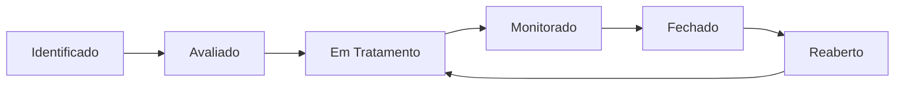

# 🛡️ CENTRO DE GESTÃO DE RISCOS CORPORATIVOS - GUIA COMPLETO

## 🎯 VISÃO GERAL

O **Centro de Gestão de Riscos Corporativos** é uma plataforma unificada e inteligente para identificação, análise, tratamento e monitoramento de riscos organizacionais. Integrado com o **Alex Risk IA**, oferece análises avançadas e automação inteligente para excelência em gestão de riscos.

### ✨ PRINCIPAIS CARACTERÍSTICAS

- **🧠 IA Integrada**: Alex Risk fornece sugestões, análises automáticas e insights contextuais
- **📊 4 Views Dinâmicas**: Dashboard, Tabela, Kanban e Processo Guiado
- **🔬 Metodologias Avançadas**: Monte Carlo, FMEA, Bow-Tie, GUT, VaB e Análise de Correlação
- **🔄 Workflow Inteligente**: Processo guiado em 8 etapas com automação
- **📱 Mobile-First**: Interface responsiva e intuitiva
- **🔒 Multi-Tenant**: Isolamento seguro de dados por organização

---

## 🚀 ACESSO E NAVEGAÇÃO

### **Acessando o Centro**
```
Navegue para: /risks
```

### **Interface Principal**
A interface é organizada em:
1. **Header Executivo** - Status do sistema e controles globais
2. **Métricas Rápidas** - KPIs em tempo real
3. **Ações Rápidas** - Acesso direto às funcionalidades principais
4. **Área de Conteúdo** - Views dinâmicas e filtros
5. **Alex Risk** - Assistente IA sempre disponível

---

## 📊 VIEWS E FUNCIONALIDADES

### **1. 📈 DASHBOARD EXECUTIVO**

**Objetivo**: Visão estratégica e panorâmica dos riscos

**Características**:
- Gráficos interativos de distribuição de riscos
- Top 5 riscos críticos
- Análise de tendências temporais
- Correlações entre categorias

**Quando Usar**:
- Reuniões executivas
- Apresentações para o board
- Análise estratégica de portfólio de riscos

**Alex Risk no Dashboard**:
- Identifica padrões e anomalias
- Sugere focos de atenção
- Analisa tendências emergentes

### **2. 📋 TABELA DETALHADA**

**Objetivo**: Gestão operacional e edição detalhada

**Características**:
- Ordenação inteligente por qualquer campo
- Filtros avançados
- Edição inline
- Exportação para CSV
- Indicadores visuais de prioridade

**Quando Usar**:
- Gestão operacional diária
- Análise detalhada de riscos específicos
- Atualização em massa de informações

**Funcionalidades Avançadas**:
- ⚠️ Destacar riscos vencidos
- 🔍 Busca global inteligente
- 📊 Métricas em tempo real
- 🎯 Ações em lote

### **3. 🎯 KANBAN WORKFLOW**

**Objetivo**: Visualização de fluxo e gestão ágil

**Características**:
- Drag & drop entre status
- Cards visuais com informações essenciais
- Progresso visual por etapa
- Métricas por coluna

**Colunas do Workflow**:
1. **Identificado** - Riscos recém registrados
2. **Avaliado** - Análise de risco concluída
3. **Em Tratamento** - Ações de mitigação ativas
4. **Monitorado** - Acompanhamento contínuo
5. **Fechado** - Riscos resolvidos

**Alex Risk no Kanban**:
- Detecta gargalos no workflow
- Sugere otimizações de processo
- Identifica riscos estagnados

### **4. 🔄 PROCESSO GUIADO**

**Objetivo**: Criação estruturada com suporte IA

**8 Etapas do Processo**:

#### **Etapa 1: 🔍 IDENTIFICAR**
- Registro básico do risco
- Categorização inteligente
- **Alex Risk**: Sugere riscos baseado em benchmarks

#### **Etapa 2: 🧠 ANALISAR**
- Avaliação de probabilidade e impacto
- Cálculo automático de score
- **Alex Risk**: Análise automática baseada em dados históricos

#### **Etapa 3: 🎯 AVALIAR**
- Identificação de stakeholders
- Mapeamento de controles existentes
- **Alex Risk**: Sugestão automática de stakeholders e controles

#### **Etapa 4: 📋 CLASSIFICAR**
- Definição de estratégia de tratamento
- Priorização baseada em apetite ao risco
- **Alex Risk**: Recomendação de estratégia ótima

#### **Etapa 5: 🛡️ TRATAR**
- Atribuição de responsáveis
- Definição de prazos
- **Alex Risk**: Geração automática de planos de ação

#### **Etapa 6: 👁️ MONITORAR**
- Configuração de KRIs
- Definição de frequência de revisão
- **Alex Risk**: Sugestão de indicadores relevantes

#### **Etapa 7: 📊 REVISAR** (Opcional)
- Avaliação de efetividade
- Ajustes de estratégia
- **Alex Risk**: Análise de performance

#### **Etapa 8: ✅ ENCERRAR** (Opcional)
- Documentação de lições aprendidas
- Arquivo formal do risco
- **Alex Risk**: Captura de conhecimento

---

## 🤖 ALEX RISK - ASSISTENTE IA

### **Capacidades Principais**

#### **🔍 Análise Contextual**
- Identificação de padrões em tempo real
- Correlações entre riscos
- Detecção de anomalias

#### **💡 Sugestões Inteligentes**
- Recomendações personalizadas por contexto
- Templates automáticos
- Melhores práticas aplicadas

#### **⚡ Automação**
- Classificação automática de riscos
- Cálculos avançados
- Notificações proativas

### **Integração Nativa**

Alex Risk está sempre disponível através do botão **🧠 Alex Risk** no header e fornece:

1. **Sugestões Contextuais** - Baseadas na view atual
2. **Análises Automáticas** - Insights em tempo real
3. **Assistência Processo** - Orientações step-by-step
4. **Alertas Inteligentes** - Notificações relevantes

### **Casos de Uso Específicos**

- **Dashboard**: Identifica tendências e padrões emergentes
- **Tabela**: Sugere otimizações e correções
- **Kanban**: Detecta gargalos e propõe soluções
- **Processo**: Guia completo com automação

---

## 🔬 METODOLOGIAS AVANÇADAS

### **1. 📈 MONTE CARLO**

**Uso**: Quantificação financeira de riscos com simulações estocásticas

**Quando Aplicar**:
- Riscos financeiros de alto impacto
- Análise de carteira de riscos
- Cálculo de reservas de contingência

**Resultados**:
- Value at Risk (VaR 95%, 99%)
- Expected Shortfall
- Distribuições de probabilidade
- Intervalos de confiança

**Alex Risk**: Sugere distribuições estatísticas e parâmetros otimizados

### **2. 🔧 FMEA (Failure Mode and Effects Analysis)**

**Uso**: Análise sistemática de modos de falha

**Quando Aplicar**:
- Riscos operacionais e de processo
- Análise de sistemas críticos
- Identificação de pontos únicos de falha

**Resultados**:
- Risk Priority Number (RPN)
- Modos de falha críticos
- Planos de ação priorizados

**Alex Risk**: Identifica automaticamente modos de falha potenciais

### **3. 🎯 BOW-TIE ANALYSIS**

**Uso**: Análise de causas, consequências e barreiras

**Quando Aplicar**:
- Riscos complexos com múltiplas causas
- Análise de efetividade de controles
- Planejamento de resposta a crises

**Resultados**:
- Mapeamento de causas raiz
- Avaliação de barreiras
- Planos de contingência

**Alex Risk**: Sugere barreiras baseadas em melhores práticas

### **4. ⚖️ MATRIZ GUT**

**Uso**: Priorização rápida baseada em Gravidade, Urgência e Tendência

**Quando Aplicar**:
- Priorização de múltiplos riscos
- Tomada de decisão rápida
- Alocação de recursos limitados

**Resultados**:
- Score GUT ponderado
- Ranking de prioridades
- Matriz de decisão

**Alex Risk**: Calibra automaticamente os pesos baseado no contexto

### **5. 💰 VALUE AT BUSINESS (VaB)**

**Uso**: Quantificação do valor em risco para o negócio

**Quando Aplicar**:
- Análise de impacto nos negócios
- Justificativa de investimentos em controles
- Comunicação com stakeholders

**Resultados**:
- Valor financeiro em risco
- Cenários de impacto
- ROI de controles

**Alex Risk**: Modela automaticamente impactos financeiros

### **6. 🔗 ANÁLISE DE CORRELAÇÃO**

**Uso**: Identificação de dependências e efeitos sistêmicos

**Quando Aplicar**:
- Gestão de carteira de riscos
- Identificação de riscos sistêmicos
- Otimização de diversificação

**Resultados**:
- Matriz de correlações
- Clusters de riscos
- Benefícios de diversificação

**Alex Risk**: Identifica correlações ocultas através de ML

---

## 📋 WORKFLOWS E APROVAÇÕES

### **Sistema de Estados**



### **Matriz de Responsabilidades**

| Função | Identificar | Avaliar | Aprovar | Monitorar | Encerrar |
|--------|-------------|---------|---------|-----------|----------|
| **Risk Owner** | ✅ | ✅ | ❌ | ✅ | ❌ |
| **Risk Manager** | ✅ | ✅ | ✅ | ✅ | ✅ |
| **CISO** | ❌ | ✅ | ✅ | ✅ | ✅ |
| **Board** | ❌ | ❌ | ✅ | ❌ | ✅ |

### **Fluxos de Aprovação**

#### **Riscos Críticos (Muito Alto/Alto)**
1. Identificação → Risk Owner
2. Avaliação → Risk Manager
3. Aprovação → CISO + Board
4. Monitoramento → Risk Manager
5. Encerramento → CISO + Board

#### **Riscos Moderados (Médio)**
1. Identificação → Risk Owner
2. Avaliação → Risk Manager
3. Aprovação → Risk Manager
4. Monitoramento → Risk Owner
5. Encerramento → Risk Manager

#### **Riscos Baixos (Baixo/Muito Baixo)**
1. Identificação → Risk Owner
2. Avaliação → Risk Owner
3. Aprovação → Automática
4. Monitoramento → Risk Owner
5. Encerramento → Risk Owner

---

## 🎯 CASOS DE USO PRÁTICOS

### **Cenário 1: CEO QUER VISÃO EXECUTIVA**

**Objetivo**: Preparar apresentação para board sobre situação de riscos

**Passos**:
1. Acesse **Dashboard Executivo**
2. Analise métricas principais e tendências
3. Revise **Top 5 Riscos Críticos**
4. Consulte **Alex Risk** para insights estratégicos
5. Exporte gráficos para apresentação

**Tempo Estimado**: 5-10 minutos

### **Cenário 2: RISK MANAGER PRECISA ATUALIZAR STATUS**

**Objetivo**: Atualizar status de múltiplos riscos após reunião de comitê

**Passos**:
1. Acesse **Tabela Detalhada**
2. Use filtros para encontrar riscos específicos
3. Edite status e responsáveis diretamente na tabela
4. Adicione comentários sobre decisões tomadas
5. Export relatório de mudanças

**Tempo Estimado**: 15-30 minutos

### **Cenário 3: NOVO ANALISTA PRECISA REGISTRAR RISCO**

**Objetivo**: Registrar novo risco identificado em auditoria

**Passos**:
1. Acesse **Processo Guiado**
2. Siga as 8 etapas com suporte do Alex Risk
3. Use sugestões automáticas para acelerar processo
4. Revise análise gerada pela IA
5. Submeta para aprovação

**Tempo Estimado**: 20-45 minutos

### **Cenário 4: AUDITORIA INTERNA QUER ANÁLISE QUANTITATIVA**

**Objetivo**: Realizar análise Monte Carlo para risco financeiro crítico

**Passos**:
1. Selecione risco na **Tabela Detalhada**
2. Acesse **Centro de Análises Avançadas**
3. Configure e execute **Monte Carlo**
4. Analise resultados e recomendações
5. Gere relatório técnico

**Tempo Estimado**: 30-60 minutos

---

## 📊 MÉTRICAS E KPIs

### **Dashboard Executivo**

#### **Métricas Principais**
- **Total de Riscos**: Quantidade total identificada
- **Riscos Críticos**: Muito Alto + Alto
- **Em Tratamento**: Riscos com ações ativas
- **Atrasados**: Ações com prazo vencido
- **Tendência**: Evolução do portfólio

#### **KPIs de Performance**
- **Tempo Médio de Resolução**: Identificação → Fechamento
- **Taxa de Mitigação**: % de riscos mitigados com sucesso
- **Efetividade de Controles**: Redução de score pós-implementação
- **Cobertura de Monitoramento**: % de riscos com KRIs ativos

### **Alertas Inteligentes**

#### **🔴 Críticos**
- Novo risco **Muito Alto** identificado
- Risco crítico sem tratamento > 7 dias
- Falha em barreira de controle crítica

#### **🟡 Importante**
- Prazo de ação vencido
- Risco mudou de nível
- KRI ultrapassou threshold

#### **🟢 Informativos**
- Risco fechado com sucesso
- Nova correlação identificada
- Sugestão de otimização disponível

---

## 🔧 CONFIGURAÇÃO E PERSONALIZAÇÃO

### **Configurações do Sistema**

#### **Apetite ao Risco**
```json
{
  "financial": {
    "veryLow": "< 0.1% receita",
    "low": "0.1% - 1% receita", 
    "medium": "1% - 5% receita",
    "high": "5% - 20% receita",
    "veryHigh": "> 20% receita"
  },
  "operational": {
    "availability": "> 99.5%",
    "errorRate": "< 0.1%",
    "customerImpact": "< 1000 clientes"
  }
}
```

#### **Metodologias Habilitadas**
- ✅ Monte Carlo (Premium)
- ✅ FMEA (Standard)
- ✅ Bow-Tie (Standard)
- ✅ GUT (Basic)
- ✅ VaB (Premium)
- ✅ Correlação (Standard)

#### **Alex Risk Configuration**
- **Nível de Automação**: Alto/Médio/Baixo
- **Sugestões Proativas**: Habilitado
- **Análise Tempo Real**: Habilitado
- **Modelo de IA**: GPT-4 Turbo
- **Contexto Organizacional**: Financeiro/Tecnologia/Saúde

### **Customização de Interface**

#### **Views Padrão**
- Dashboard: Executivos e C-Level
- Tabela: Risk Managers e Analistas
- Kanban: Equipes Operacionais
- Processo: Novos Usuários

#### **Filtros Favoritos**
- Riscos Críticos Ativos
- Meus Riscos Atribuídos
- Vencidos Esta Semana
- Novos Últimos 30 Dias

---

## 🚨 TROUBLESHOOTING

### **Problemas Comuns**

#### **🔍 "Não consigo ver meus riscos"**
**Causa**: Filtros muito restritivos ou problemas de permissão
**Solução**:
1. Clique em "Limpar Filtros"
2. Verifique permissões com administrador
3. Confirme tenant correto

#### **🤖 "Alex Risk não está respondendo"**
**Causa**: Sobrecarga do serviço ou configuração
**Solução**:
1. Aguarde 30 segundos e tente novamente
2. Verifique conexão com internet
3. Contate suporte se persistir

#### **📊 "Análise Monte Carlo falhou"**
**Causa**: Dados insuficientes ou configuração inválida
**Solução**:
1. Verifique se o risco tem dados financeiros
2. Reduza número de simulações
3. Ajuste parâmetros de distribuição

#### **🔄 "Workflow está travado"**
**Causa**: Dependências de aprovação ou dados obrigatórios
**Solução**:
1. Verifique campos obrigatórios
2. Confirme aprovações pendentes
3. Consulte Alex Risk para orientações

### **Contatos de Suporte**

- **Suporte Técnico**: Claude Code Support
- **Treinamento**: Risk Management Team
- **Alex Risk**: AI Support Team

---

## 📚 RECURSOS ADICIONAIS

### **Treinamentos Disponíveis**

1. **Fundamentos de Gestão de Riscos** (2h)
   - Conceitos básicos
   - Navegação na plataforma
   - Processo de 8 etapas

2. **Alex Risk Avançado** (1h)
   - Maximizando uso da IA
   - Interpretação de sugestões
   - Configurações personalizadas

3. **Metodologias Quantitativas** (3h)
   - Monte Carlo para gestores
   - FMEA aplicado
   - Análise de correlações

4. **Dashboard Executivo** (30min)
   - Preparação de apresentações
   - Interpretação de métricas
   - Comunicação de riscos

### **Documentação Técnica**

- **API Reference**: Para integrações
- **Data Model**: Estrutura do banco
- **Security Guide**: Configurações de segurança
- **Admin Manual**: Gestão de usuários e permissões

### **Comunidade e Suporte**

- **Portal de Conhecimento**: Base de artigos e FAQs
- **Fórum de Usuários**: Discussões e melhores práticas
- **Webinars Mensais**: Novidades e casos de sucesso
- **Consultoria Especializada**: Implementação e otimização

---

## 🎯 CONCLUSÃO

O **Centro de Gestão de Riscos Corporativos** representa a evolução da gestão de riscos tradicional para uma abordagem inteligente, integrada e orientada por dados. Com o **Alex Risk** como copiloto, organizações podem:

- ⚡ **Acelerar** identificação e análise de riscos
- 🎯 **Otimizar** alocação de recursos de mitigação  
- 📊 **Quantificar** impactos com precisão científica
- 🔮 **Antecipar** riscos emergentes
- 🛡️ **Fortalecer** resiliência organizacional

**A excelência em gestão de riscos começa aqui. Bem-vindo ao futuro da gestão de riscos corporativos!**

---

*Documentação versão 2.0 - Atualizada em Agosto 2025*
*Para dúvidas ou sugestões: grc-team@organization.com*